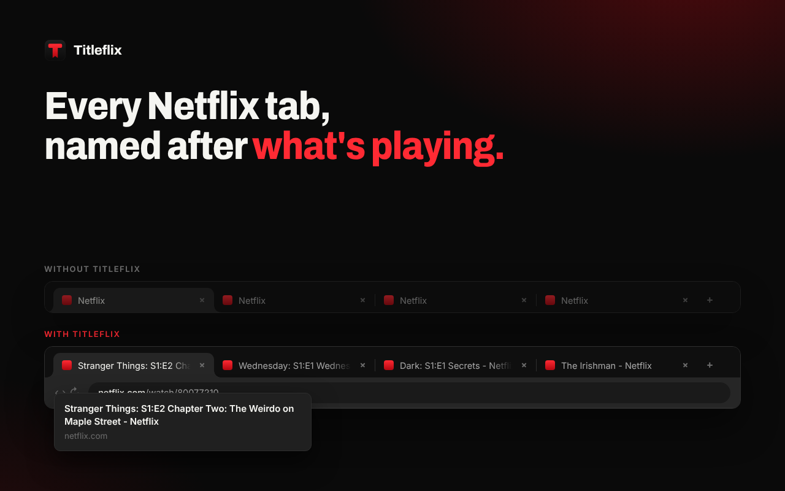
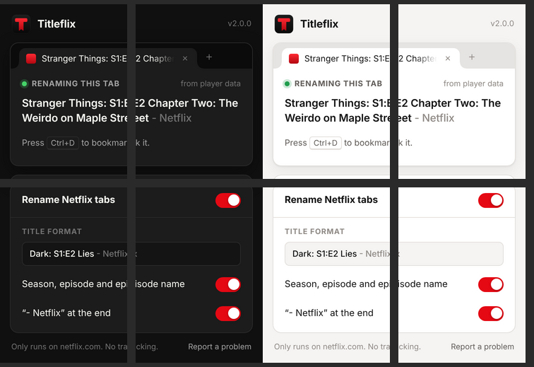

<div align="center">
  
  <h1>Titleflix</h1>
  <p><strong>Real names for your Netflix tabs and bookmarks.</strong></p>

[](https://chromewebstore.google.com/detail/titleflix)
[](https://github.com/doguyilmaz/titleflix/actions/workflows/ci.yml)
[](LICENSE)

</div>

Every Netflix tab is called "Netflix", so every Netflix bookmark is called "Netflix". Titleflix renames the tab to what is actually playing:

```
Before                         After
🔖 Netflix                      🔖 Stranger Things: S1:E3 Chapter Three: Holly, Jolly - Netflix
🔖 Netflix                      🔖 Devil May Cry: S1:E1 Inferno - Netflix
🔖 Netflix                      🔖 1917 - Netflix
```

<p align="center"></p>

## Features

- **Season, episode and episode title** for shows, or just the title for movies.
- **Keeps up with Netflix**: next episode, autoplay, back/forward and in-app navigation update the title instantly.
- **Holds the title**: when Netflix resets the tab title, Titleflix puts it back before the next frame, so there's no flicker.
- **Settings apply live**: turning it off or changing the format updates open tabs without reloading the video.
- **Works in tabs that were already open** when you install or update the extension.
- **Private by design**: runs only on `www.netflix.com`, makes no network requests, and stores nothing but your three settings.

## How it finds the title

Netflix only shows the title on screen while the player controls are visible, which is why older versions sometimes missed it. Titleflix now checks several sources and keeps the most reliable answer for each video:

| Priority | Source | When it's available |
| --- | --- | --- |
| 1 | Netflix's player data (show, season, episode, episode title) | As soon as the video loads |
| 2 | The title in the player controls | While the controls are visible |
| 3 | The "You're watching" pause screen | After pausing for a while |
| 3 | Chrome's media controls (Media Session) | If Netflix provides it |

A weaker source never replaces a stronger one for the same video. Once a title is found it stays until you move to another video.

## Install

**Chrome Web Store:** [Titleflix](https://chromewebstore.google.com/detail/titleflix) → *Add to Chrome*.

**From source:**

```bash
bun install
bun run build
```

Then open `chrome://extensions`, turn on **Developer mode**, click **Load unpacked** and pick the `dist` folder. Requires Chrome 111 or newer.

## Settings

Click the Titleflix icon in the toolbar:

<p align="center"></p>

| Setting | Default | Effect |
| --- | --- | --- |
| Rename Netflix tabs | On | Off restores Netflix's own titles immediately |
| Season, episode and episode name | On | `Dark: S1:E2 Lies` vs. `Dark` |
| “- Netflix” at the end | On | Adds ` - Netflix` so bookmarks are easy to search |

The popup also shows the title being applied to the current tab and where it came from. If something looks wrong, **Report a problem** opens a GitHub issue pre-filled with your extension and browser version (never what you're watching).

## Privacy and permissions

| Permission | Why |
| --- | --- |
| `https://www.netflix.com/*` | Read what's playing and set the tab title. No other site is touched. |
| `storage` | Save your three settings (synced through your Chrome profile). |
| `scripting` | Start Titleflix in Netflix tabs that were already open when it was installed or updated. |

No analytics, no remote code, no network requests. See the [privacy policy](PRIVACY_POLICY.md).

## Development

Requires [Bun](https://bun.sh) 1.2+.

| Command | What it does |
| --- | --- |
| `bun run build` | Bundle the extension into `dist/` |
| `bun run dev` | Rebuild on every change |
| `bun run lint` | Type-check everything |
| `bun test` | Unit tests (title parsing, formatting, player-data parsing, settings migration) |
| `bun run test:e2e` | Build, then run the extension in Chromium against a simulated Netflix |
| `bun run check` | All of the above |
| `bun run package` | Build and create `titleflix-v<version>.zip` for the Web Store |
| `bun run icons` | Re-render `assets/icons/*.png` from the SVG logos |
| `bun run store:images` | Re-render the Chrome Web Store images |
| `bun run bump:patch` | Bump the version in `package.json` and `manifest.json`, commit and tag (also `bump:minor`, `bump:major`) |

### Project layout

```
src/
├── content/
│   ├── index.ts      # Content script: navigation, title enforcement, lifecycle
│   └── extract.ts    # Readers for each title source
├── bridge.ts         # Runs in the page to read Netflix's player data; answers content-script queries
├── background.ts     # Install/update: settings migration, injection into open tabs
├── popup/            # Toolbar popup (HTML, CSS, TS)
└── shared/           # Pure logic shared by all of the above (title formatting, metadata parsing, settings)
assets/               # Logo SVGs and rendered PNG icons
store/                # Web Store images (source + rendered) and listing copy
tests/
├── unit/             # bun test
└── e2e/              # Playwright: real extension + simulated Netflix app
```

### How the end-to-end tests work

The Playwright suite loads the built extension into Chromium and serves a small fake Netflix app ([`tests/e2e/fixtures/fake-netflix.html`](tests/e2e/fixtures/fake-netflix.html)) at real `https://www.netflix.com/...` URLs, so the manifest's match patterns, both content-script worlds, the service worker and the popup run exactly as they would on Netflix. The fake app reproduces the behaviour Titleflix depends on: `history.pushState` navigation, controls that appear and disappear, the pause overlay, the player-data object, and Netflix overwriting `document.title`.

The tests can't log in to a real Netflix account, so the fake app is based on Netflix's DOM and player data as known today. If Netflix changes its markup, run through the manual checklist below and update the fixture together with the code.

To use a Chromium that is already installed instead of Playwright's download, set `CHROMIUM_PATH=/path/to/chrome`.

### Testing on real Netflix

The automated tests can't sign in to Netflix. [docs/testing-on-netflix.md](docs/testing-on-netflix.md) has the checklist for your own account, a debug log you can turn on (`localStorage.setItem('titleflix:debug', '1')` in the Netflix tab), and a ready-made prompt for running the checklist with Claude in Chrome.

### Store images

`bun run store:images` captures the real popup in every state and renders the Chrome Web Store screenshots and promo tiles from [`store/images.html`](store/images.html) into `store/images/`. Listing copy (English and Turkish) and permission justifications are in [`store/listing.md`](store/listing.md).

## Contributing

Issues and pull requests are welcome. Please run `bun run check` before opening a PR. CI runs the same checks.

## License

[MIT](LICENSE) © Dogu Yilmaz · [doguyilmaz.com](https://doguyilmaz.com) · [hello@doguyilmaz.com](mailto:hello@doguyilmaz.com)

Titleflix is an independent project and is not affiliated with or endorsed by Netflix, Inc.
